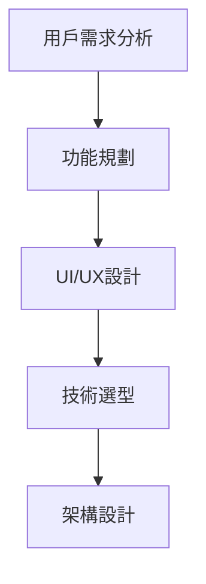

# Todo Full Stack Application

> **專案定位**: 展示全端開發能力的任務管理系統  
> **角色目標**: Junior Full-Stack Engineer | Frontend Specialized  
> **技術重點**: 現代化前端架構 + 全端整合能力

## 🎯 專案概述

這是一個完整的全端待辦事項管理應用，展示了從需求分析到部署的完整開發流程。專案特別突出**前端專業技能**，同時證明**全端開發能力**。

### 🌟 核心價值展示

- **前端專精**: React/Next.js + TypeScript + 現代化UI/UX設計
- **全端能力**: 獨立完成前後端開發與API設計
- **產品思維**: 用戶體驗導向的功能設計與實現
- **工程品質**: 完整的開發流程與代碼標準

## 🎬 專案演示說明

### Demo流程設計

```typescript
// 完整的演示流程
1. 環境準備
   - 清除資料庫原始資料
   - 注入種子資料
   - 確認資料庫內容已注入完成

2. 專案啟動
   - 於root使用 pnpm run dev 同時啟動前後端伺服器
   - 前端: http://localhost:3000
   - 後端: http://localhost:4000

3. 功能演示
   - 透過測試帳號登入應用程式
   - 新增一則todo項目
   - 更新一則todo項目
   - 刪除一則todo但是反悔（撤銷功能）
   - 確實刪除一則todo項目
   - 展示多語言切換功能
   - 展示響應式設計適配
```

### 測試帳號資訊

```
Email: demo@example.com
Password: demo1234

// 快速體驗功能
✅ 完整的CRUD操作
✅ 即時狀態更新
✅ 撤銷刪除功能
✅ 多語言支援
✅ 響應式設計
```

## 💻 技術棧

### Frontend (Next.js) - 主要技能展示

```typescript
// 核心技術
Next.js 14         // React框架 + SSR
TypeScript         // 型別安全
Tailwind CSS       // 現代化CSS框架
shadcn/ui          // 高品質UI組件庫

// 進階特性
響應式設計         // 多裝置適配
國際化(i18n)       // 英文/中文支援
鍵盤導航           // 無障礙設計
狀態管理           // React Context + Hooks
```

### Backend (Express.js) - 全端能力證明

```typescript
// 後端技術
Express.js + TypeScript    // RESTful API
MongoDB + Mongoose         // NoSQL資料庫
JWT Authentication         // 身份驗證
CORS + 安全性設定          // API安全

// API設計
RESTful架構               // 標準化API設計
錯誤處理機制              // 完整錯誤處理
資料驗證                  // 輸入驗證與清理
```

## ✨ 功能特色

### 🎨 前端專業特性

#### 1. 現代化用戶介面

- **響應式設計**: 完美適配桌面/平板/手機
- **直覺操作**: 拖拽、快捷鍵、狀態切換
- **視覺反饋**: 動畫效果、載入狀態、操作確認

#### 2. 多元檢視模式

```typescript
// 靈活的數據展示
看板視圖 (Board View)     // 按狀態分組的卡片佈局
列表視圖 (List View)      // 傳統列表顯示
儀表板視圖               // 數據視覺化圖表
```

#### 3. 無障礙設計

- **鍵盤導航**: 完整的鍵盤操作支援
- **快捷鍵系統**: 提升操作效率
- **語音輔助友善**: 適當的ARIA標籤

#### 4. 國際化支援

- **多語言**: 英文/繁體中文動態切換
- **語言記憶**: localStorage持久化偏好
- **瀏覽器檢測**: 自動設定初始語言

### 🔧 全端整合能力

#### 1. 完整的認證系統

```typescript
// JWT身份驗證流程
用戶登入 → 生成 JWT Token → 前端儲存與使用 Token → 路由保護
```

#### 2. RESTful API設計

```typescript
// 標準化API端點設計
POST   /auth/register       // 註冊新用戶
POST   /auth/login          // 用戶登入
GET    /api/todos           // 獲取所有待辦事項
POST   /api/todos           // 創建新的待辦事項
PUT    /api/todos/:id       // 更新特定待辦事項
DELETE /api/todos/:id       // 刪除特定待辦事項
GET    /api/todos/stats     // 統計數據

// MVC架構實現
Route → Controller → Model → Database
API路由   業務邏輯    資料庫交互   MongoDB
```

#### 3. 數據視覺化

- **完成率統計**: 實時計算任務完成比例
- **趨勢分析**: 任務創建/完成時間趨勢
- **狀態分佈**: 不同狀態任務的分佈圖表

## 🛠️ 技術實現亮點

### Frontend 架構設計

#### 1. 組件化設計

```typescript
// 可重用組件架構
components/
├── ui/           // 基礎UI組件 (shadcn/ui)
├── forms/        // 表單組件
├── layout/       // 佈局組件
└── features/     // 功能組件
    ├── todos/    // 任務相關組件
    ├── auth/     // 認證組件
    └── dashboard/ // 儀表板組件
```

#### 2. 狀態管理策略

```typescript
// React Context + Custom Hooks
const TodoContext = createContext<TodoContextType>();

// 自定義Hooks封裝業務邏輯
const useTodos = () => {
  const [todos, setTodos] = useState<Todo[]>([]);
  const [loading, setLoading] = useState(false);
  // CRUD操作邏輯
};
```

#### 3. 型別安全保障

```typescript
// 完整的TypeScript型別定義
interface Todo {
  _id: string;
  title: string;
  description?: string;
  status: 'pending' | 'in-progress' | 'completed';
  createdAt: Date;
  updatedAt: Date;
}

// API響應型別
interface ApiResponse<T> {
  success: boolean;
  data: T;
  message?: string;
}
```

### Backend 架構設計

#### 1. 模組化結構

```typescript
// 清晰的目錄結構
backend/src/
├── controllers/    // 控制器邏輯
├── models/        // 數據模型
├── routes/        // 路由定義
├── middleware/    // 中間件
├── utils/         // 工具函數
└── types/         // 型別定義
```

#### 2. 錯誤處理機制

```typescript
// 統一錯誤處理
const errorHandler = (err: Error, req: Request, res: Response) => {
  const statusCode = err.statusCode || 500;
  res.status(statusCode).json({
    success: false,
    message: err.message,
    stack: process.env.NODE_ENV === 'development' ? err.stack : null,
  });
};
```

## 📊 開發流程展示

### 1. 需求分析與設計



### 2. 開發進度管理

- ✅ **第一階段**: 基礎架構建立 (Monorepo + TypeScript)
- ✅ **第二階段**: 認證系統實現 (JWT + 路由保護)
- ✅ **第三階段**: 核心功能開發 (CRUD + 狀態管理)
- ✅ **第四階段**: UI/UX優化 (響應式 + 動畫效果)
- ✅ **第五階段**: 進階功能 (國際化 + 數據視覺化)
- 🚧 **第六階段**: 部署與優化 (CI/CD + 性能優化)

### 3. 代碼品質保證

```json
// ESLint + Prettier 配置
{
  "extends": ["next/core-web-vitals", "@typescript-eslint/recommended"],
  "rules": {
    "prefer-const": "error",
    "no-unused-vars": "error",
    "@typescript-eslint/no-explicit-any": "warn"
  }
}
```

## 🚀 快速開始

### 環境要求

```bash
Node.js >= 18.0.0
pnpm >= 8.0.0
MongoDB >= 6.0.0
```

### 本地開發

```bash
# 1. 克隆專案
git clone https://github.com/username/todo-fullstack.git
cd todo-fullstack

# 2. 安裝依賴
pnpm install

# 3. 配置環境變數
cp apps/backend/.env.example apps/backend/.env
cp apps/frontend/.env.example apps/frontend/.env.local

# 4. 啟動開發服務器
pnpm dev        # 同時啟動前後端
# 或分別啟動
pnpm dev:backend    # 後端: http://localhost:4000
pnpm dev:frontend   # 前端: http://localhost:3000
```

### 部署流程

```bash
# 構建生產版本
pnpm build

# 運行生產服務器
pnpm start
```

---

## 📈 效能與優化

### Frontend 優化策略

```typescript
// 1. Code Splitting
const TodoList = lazy(() => import('./components/TodoList'));
const Dashboard = lazy(() => import('./components/Dashboard'));

// 2. 圖片優化
import Image from 'next/image';
<Image src="/hero.jpg" alt="Hero" width={800} height={600} priority />

// 3. API請求優化
const useTodos = () => {
  const [todos, setTodos] = useState<Todo[]>([]);

  // 防抖搜索
  const debouncedSearch = useMemo(
    () => debounce((term: string) => searchTodos(term), 300),
    []
  );
};
```

### Backend 優化策略

```typescript
// 1. 數據庫查詢優化
const todos = await Todo.find({ userId })
  .select('title status createdAt') // 只選擇需要的字段
  .sort({ createdAt: -1 }) // 索引排序
  .limit(50); // 分頁限制

// 2. 響應快取
app.use('/api/todos', cache('5 minutes'), todoRoutes);

// 3. 壓縮中間件
app.use(compression());
```

## 🧪 測試策略

### Frontend 測試

```typescript
// Jest + React Testing Library
describe('TodoList Component', () => {
  test('renders todo items correctly', () => {
    render(<TodoList todos={mockTodos} />);
    expect(screen.getByText('Sample Todo')).toBeInTheDocument();
  });

  test('handles status toggle', async () => {
    const onToggle = jest.fn();
    render(<TodoItem todo={mockTodo} onToggle={onToggle} />);

    fireEvent.click(screen.getByRole('button'));
    expect(onToggle).toHaveBeenCalledWith(mockTodo._id);
  });
});
```

### Backend 測試

```typescript
// Jest + Supertest
describe('Todo API', () => {
  test('GET /api/todos returns user todos', async () => {
    const response = await request(app)
      .get('/api/todos')
      .set('Authorization', `Bearer ${authToken}`);

    expect(response.status).toBe(200);
    expect(response.body.success).toBe(true);
  });
});
```

## 📚 學習收穫與技術成長

### 前端技能提升

- ✅ **Next.js 進階特性**: SSR、API Routes、Image Optimization
- ✅ **TypeScript 實戰**: 複雜型別定義、泛型應用
- ✅ **UI/UX 實現**: 響應式設計、動畫效果、無障礙設計
- ✅ **狀態管理**: Context API、Custom Hooks 最佳實踐

### 全端整合經驗

- ✅ **API 設計**: RESTful規範、錯誤處理、文檔化
- ✅ **資料庫設計**: MongoDB Schema設計、查詢優化
- ✅ **認證機制**: JWT實現、路由保護、權限控制
- ✅ **部署流程**: 環境配置、CI/CD、性能監控

### 軟技能發展

- ✅ **產品思維**: 用戶需求分析、功能優先級判斷
- ✅ **專案管理**: 進度規劃、任務分解、版本控制
- ✅ **問題解決**: 除錯技巧、性能分析、優化策略

## 👨‍💻 開發者資訊

**劉菁莛 (Jenny Liou)**  
Junior Frontend Specialist | Full-Stack Developer

- 💼 2年+ 前端開發經驗
- 🎓 雲林科技大學數位媒體設計系
- 🌟 擅長React/Next.js + TypeScript
- 🚀 具備產品思維與設計美感
- 🗾 日語JLPT N2認證

**技能標籤**: `React` `Next.js` `TypeScript` `Node.js` `MongoDB` `UI/UX` `產品思維`
